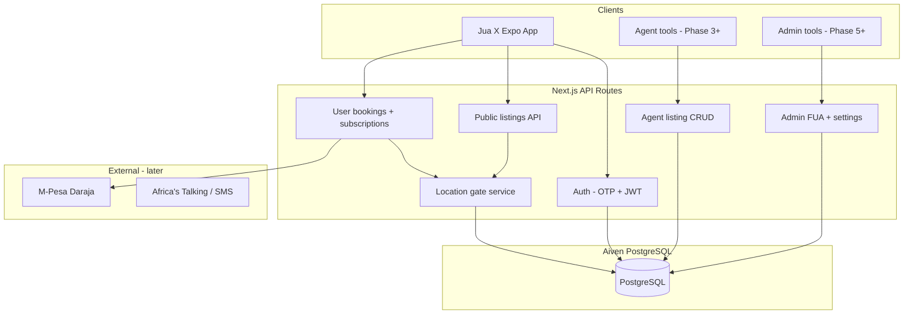

# Architecture

## System context



## Location gate (critical)

All listing responses pass through a **LocationGate** service:

```
Input:  listing row + user context (subscriptions, bookings)
Output: PublicListingDto | UnlockedListingDto
```

Never return `exact_address`, `exact_lat`, `exact_lng`, `host_phone`, or `host_whatsapp` unless:

| Listing type | Condition |
|--------------|-----------|
| `rental` | Active `subscription` with `payment_status = success` and `expires_at > now()` |
| `bnb` | `bnb_booking` for this user + listing with `status = confirmed` |

Approximate coordinates are always derived server-side (never send exact coords to client for free tier).

## Auth flow

1. User enters +254 phone in Expo `AuthScreen`
2. `POST /auth/otp/send` — 6-digit code (SMS provider TBD; dev mode returns fixed code in logs)
3. `POST /auth/otp/verify` — returns JWT (`sub`, `role`, `phone`)
4. Expo stores token in `expo-secure-store`
5. All API calls: `Authorization: Bearer <token>`

First-time users set `display_name` after OTP (already in app flow).

## Agent workflow (MVP)

Agents do **not** need a separate app at first — options:

| Option | When |
|--------|------|
| **Postman / Bruno collection** | Phase 3 dev |
| **Simple agent web form** | Phase 3+ |
| **Retool / Appsmith** | Fastest admin/agent UI |

Agent creates listing as `draft` → fills text properties → `publish` → appears in user `GET /listings`.

## Admin workflow (FUA)

1. User confirms FUA order → row in `laundry_orders` status `requested`
2. Admin polls `GET /admin/laundry/orders?status=requested`
3. Admin advances status → `laundry_status_events` audit trail
4. User sees stepper in Trips tab via `GET /laundry/orders/{id}`

## Deployment

| Env | API | DB |
|-----|-----|-----|
| Dev | `localhost:5080` (`npm run dev`) | Aiven |
| Staging / Prod | **Vercel** (`https://<project>.vercel.app`) | Aiven |

### Vercel notes

- Set `DATABASE_URL`, `JWT_SECRET`, and `CORS_ORIGINS` in the Vercel dashboard — never commit them.
- Run SQL migrations with `psql` from your machine against Aiven (one-time / when schema changes).
- Serverless functions open short-lived DB connections; if Aiven hits connection limits, enable Aiven’s **connection pooler** and point `DATABASE_URL` at the pooler URL.
- M-Pesa callback URLs must use your public Vercel domain (e.g. `https://<project>.vercel.app/api/v1/.../callback`).
