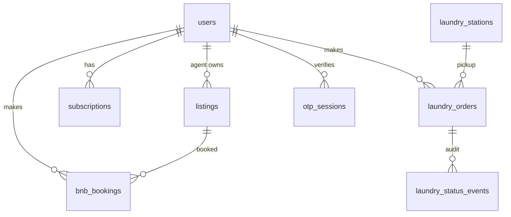

# Data model

## Entity relationship (MVP)



## `users`

| Column | Notes |
|--------|-------|
| `phone_e164` | Unique, +254 format |
| `role` | `user` · `agent` · `admin` |
| `display_name` | Set after first OTP |

## `listings` (Saka Keja)

| Column | Public | Gated |
|--------|--------|-------|
| `title`, `description` | Yes | — |
| `neighborhood`, `county` | Yes | — |
| `beds`, `baths`, `sqm`, `furnished`, `amenities` | Yes | — |
| `price_kes`, `price_unit` | Yes | — |
| `approx_lat`, `approx_lng` | Yes | — |
| `exact_address`, `exact_lat`, `exact_lng` | — | Yes |
| `host_name`, `host_phone`, `host_whatsapp` | — | Yes |
| `vacant` | Rentals: filter `true` only | — |
| `type` | `bnb` \| `rental` | — |
| `status` | `draft` \| `published` \| `archived` | — |

**TODO:** `listing_images` (Phase backlog)

## `subscriptions`

| Plan | Duration | Typical KES (configurable) |
|------|----------|--------------------------|
| `daily` | 24 h | 99 |
| `weekly` | 7 d | 299 |
| `monthly` | 30 d | 599 |

Unlocks **all rental** exact locations until `expires_at`.

## `bnb_bookings`

Book-to-reveal: exact location only when `status = confirmed` and `payment_status = success`.

## `laundry_orders`

| Field | Notes |
|-------|-------|
| `pickup_mode` | `door` \| `station` |
| `load_kg` | Default 4 |
| `schedule_date` + `schedule_band` | Day chip + morning/afternoon/evening |
| `status` | See enum in migration |
| `total_kes` | Computed server-side |

## `app_settings` keys

| Key | Default | Purpose |
|-----|---------|---------|
| `rental_location_requires_subscription` | `true` | Gate rental pins |
| `bnb_location_requires_subscription` | `false` | BnB uses booking only |
| `default_search_radius_km` | `5` | Kisumu pilot |
| `kisumu_only_listings` | `true` | County filter |
| `rides_enabled` | `false` | Coming soon |

## Public vs unlocked DTO example

**Public** (`GET /listings/{id}`):

```json
{
  "id": "...",
  "type": "rental",
  "title": "Nyamasaria 2BR",
  "neighborhood": "Nyamasaria",
  "county": "kisumu",
  "priceKes": 22000,
  "priceUnit": "month",
  "beds": 2,
  "amenities": ["Water", "Parking"],
  "approxPin": { "lat": -0.095, "lng": 34.772 },
  "locationLocked": true
}
```

**Unlocked** (subscription active):

```json
{
  "...": "...",
  "exactAddress": "Plot 12, Nyamasaria Rd",
  "exactPin": { "lat": -0.093, "lng": 34.769 },
  "hostName": "Joseph O.",
  "hostWhatsapp": "254722456789",
  "locationLocked": false
}
```
